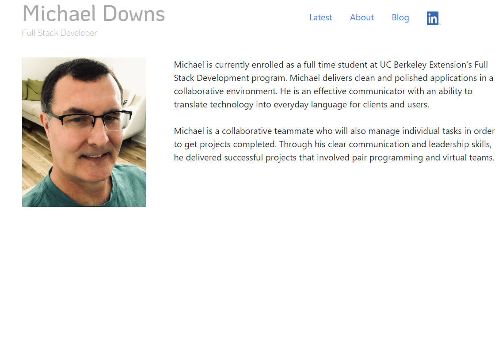

# Michael Downs Full Stack Portfolio
This is a full stack portfolio serving pages on heroku node and mongo services using handlebars for a template.  The clean portfolio uses timed animation showing the different sections on the menu.  

## Site Image

## Technology Skills
* HTML / CSS / Bootstrap Frameworks
* Javascript / jQuery
* Nodejs
* APIs rss2json for Medium blog RSS Feed
* Mongo and Mongoose (ODM)

## Author Links
   

#### Michael Downs
http://www.linkedin.com/in/michaeldownssj
https://chindowns.github.io/
https://michaeldownsportfolio.heroku.com
